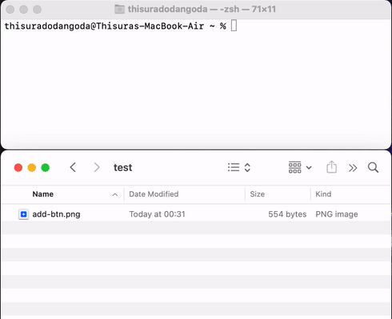

# iOS Icon Generator

**Convert images to scaled iOS Assets in a flash (no dependencies required)!**



### Installation

Makes the file executable and copies it to `/usr/local/bin` so it can be accessed from anywhere.

1. Clone this repo.
2. `cd ios-icon-generator`
3. `chmod +x igen`
4. `cp igen /usr/local/bin/igen`


### Example

Convert `sunset.jpg` file into `icon.jpg`, `icon@2x.jpg` & `icon@3x.jpg`.

__Command__
```
igen sunset.jpg icon.jpg
```

__Output__
```
Using 'sunset.jpg' to convert...
(3/3) Files Created Successfully!
1. icon.jpg = 300 x 300
2. icon@2x.jpg = 603.00 x 603.00
3. icon@3x.jpg = 900 x 900
```

__Note__

Omit the second parameter (`icon.jpg`) to use the same name.

__Finder__


### Contributions 

Rename `igen` to `igen.sh` and make your edits. The `igen` file is Shell Script.

Pull requests are welcome.


### Requirements (inbuilt in macOS)

- [sips](https://ss64.com/osx/sips.html) - Scriptable Image Processing System
- [bc](https://www.gnu.org/software/bc/manual/html_mono/bc.html) - Basic Calculator 
- [sed](https://www.gnu.org/software/sed/manual/sed.html) - Stream Editor
